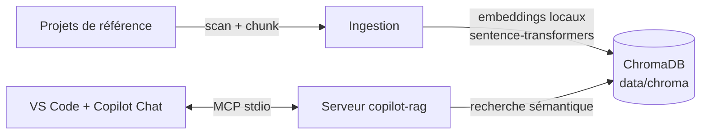

# CopilotRAG

Base **RAG locale** qui indexe le code de vos projets de référence et le rend
interrogeable par **GitHub Copilot** via un serveur **MCP**. Objectif : lors d'un
nouveau développement, Copilot retrouve les implémentations et conventions
existantes et génère un **code homogène**.



- 100 % local : aucune clé API, aucune donnée ne quitte la machine.
- Ingestion incrémentale : seuls les fichiers modifiés sont ré-indexés.
- Respecte les `.gitignore` + patterns include/exclude par projet.

## Installation

```powershell
py -3 -m venv .venv
.\.venv\Scripts\python.exe -m pip install -e .[dev]
```

> Le premier run télécharge le modèle d'embeddings (~100 Mo) puis le met en cache.

## Configuration

Éditez [config/projects.yaml](config/projects.yaml) et listez vos projets.
Deux sources possibles : un **dossier local** (`path`) ou l'**URL d'un dépôt git**
(`git`), cloné une fois dans `data/repos` puis mis à jour automatiquement à
chaque ingestion (clone shallow, `git` doit être sur le PATH) :

```yaml
projects:
  - name: mon-backend
    path: D:/wks/MonBackend
    include: ["**/*.cs", "**/*.sql", "**/*.md"]   # optionnel
    exclude: ["**/generated/**"]                  # optionnel

  - name: mon-frontend
    git: https://github.com/mon-org/mon-frontend.git
    ref: main                                     # optionnel : branche, tag ou commit
```

> L'ingestion est incrémentale aussi pour les dépôts git : après le `fetch`,
> seuls les fichiers dont le hash a changé sont ré-indexés.

## Ingestion

```powershell
.\scripts\ingest.ps1                    # tout indexer (incrémental)
.\scripts\ingest.ps1 -Project mon-backend
.\scripts\ingest.ps1 -Force             # tout ré-indexer
```

## Utilisation dans Copilot

Le serveur MCP est déclaré dans [.vscode/mcp.json](.vscode/mcp.json) : VS Code le
démarre automatiquement dans **ce** workspace. Dans Copilot Chat (mode Agent),
les outils disponibles sont :

| Outil | Rôle |
|---|---|
| `search_code` | Recherche sémantique de code (filtres projet/langage) |
| `find_similar_code` | Trouve du code similaire à un extrait |
| `search_documentation` | Recherche dans les README / docs indexés |
| `list_projects` | Liste les projets indexés |
| `index_stats` | Volumes par projet et par langage |

Exemples de prompts Copilot :

- « Avant d'écrire ce service, cherche dans copilot-rag comment les autres projets
  implémentent l'accès aux données. »
- « Utilise search_documentation pour retrouver nos conventions de logging. »

### Rendre la base disponible dans tous les workspaces

Pour interroger la base **depuis n'importe quel projet**, ajoutez le serveur à la
configuration MCP utilisateur (Palette de commandes → `MCP: Open User Configuration`) :

```json
{
  "servers": {
    "copilot-rag": {
      "type": "stdio",
      "command": "D:\\wks\\Labo\\CopilotRAG\\.venv\\Scripts\\python.exe",
      "args": ["-m", "copilot_rag.server"],
      "cwd": "D:\\wks\\Labo\\CopilotRAG"
    }
  }
}
```

### Obliger Copilot à exploiter la base dans un projet

Copiez le modèle [templates/copilot-instructions.md](templates/copilot-instructions.md)
dans `.github/copilot-instructions.md` du projet consommateur : il impose à Copilot
de consulter la base RAG avant/après toute écriture de code et de s'aligner sur les
patterns des projets indexés.

## Tests et vérifications

```powershell
.\.venv\Scripts\python.exe -m pytest                 # tests unitaires
.\.venv\Scripts\python.exe scripts\smoke_test.py     # test de bout en bout du serveur MCP
```

Des configurations de débogage sont fournies ([.vscode/launch.json](.vscode/launch.json)) :
**RAG : Ingestion** et **RAG : Smoke test MCP**.

## Structure

```
config/projects.yaml   # projets à indexer (dossier local ou URL git), modèle, chunking
src/copilot_rag/       # config, chunker, embeddings, store, gitsync, ingest, server
scripts/               # ingest.ps1, smoke_test.py
samples/demo-api/      # projet d'exemple indexé par défaut
data/chroma/           # base vectorielle (générée, git-ignorée)
data/repos/            # clones locaux des dépôts git (généré, git-ignoré)
```

## Références

- SDK MCP Python : https://py.sdk.modelcontextprotocol.io/
- Spécification MCP : https://modelcontextprotocol.io/
- sentence-transformers : https://sbert.net/
- ChromaDB : https://docs.trychroma.com/
